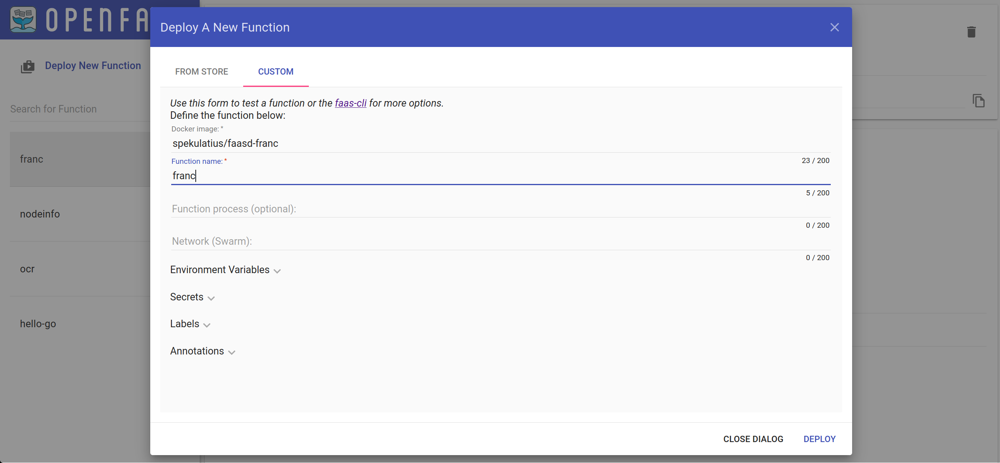

# Faasd function for Franc

**This is part of [my personal exploring](https://github.com/spekulatius/hacks) and probably not production ready. Use at own risk!**

## Preface

[faasd](https://github.com/openfaas/faasd) has been really interesting to explore and work with. It's a low-footprint no/low-maintenance Function as a Service toolkit. Broadly speaking, faasd's goal is to simplify the required setup and run functions easier.

I wanted to build a super simple api endpoint to familiarize myself more with the concepts and learn. I picked the [Franc](https://github.com/wooorm/franc) npm package. Franc is a npm lib which allows you to detect the language of a given piece of text.

The faasd function for franc is the result. It should work, but no guarantees.

## Installation

On your running faasd instance you can install it using the UI:

Alternatively, you can clone and build the code yourself.
